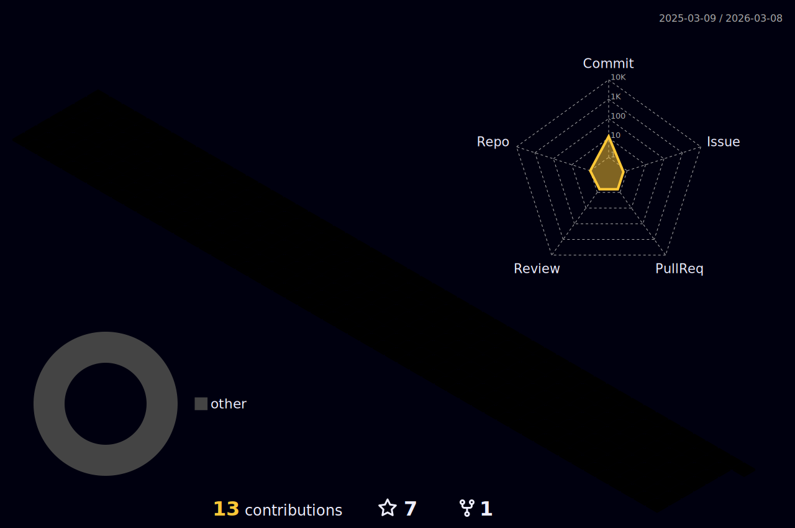

  
  
  
  

<h1 align="center">
  
  𝐇𝐞𝐥𝐥𝐨 &lt;World/&gt;!
  
</h1>

 
 

#### ⦿ 🌱 𝙸’𝚖 𝚌𝚞𝚛𝚛𝚎𝚗𝚝𝚕𝚢 pursuing my Master's in Financial Mathematics at the University of Chicago

⦿ 👯 𝙸’𝚖 𝚕𝚘𝚘𝚔𝚒𝚗𝚐 𝚝𝚘 𝚌𝚘𝚕𝚕𝚊𝚋𝚘𝚛𝚊𝚝𝚎 𝚘𝚗 **more Quant Finance related projects**

⦿ 😄 𝙿𝚛𝚘𝚗𝚘𝚞𝚗𝚜 : **𝙷𝚎/𝙷𝚒𝚖/𝙷𝚒𝚜**

⦿ ⚡ 𝙵𝚞𝚗 𝚏𝚊𝚌𝚝 : **“The root is the the top of the Tree!”**

 
 

 

#

 

**𝙻𝙰𝙽𝙶𝚄𝙰𝙶𝙴𝚂 𝙰𝙽𝙳 𝚃𝙾𝙾𝙻𝚂:**  
 
 

<code></code>
<code></code>
<code></code>

# 

<code></code>
<code></code>
<code></code>

 

# 𝙂𝙞𝙩𝙃𝙪𝙗 𝙎𝙩𝙖𝙩𝙨

  

 

  <g-emoji class="g-emoji" alias="chart_with_upwards_trend" fallback-src="https://github.githubassets.com/images/icons/emoji/unicode/1f4c8.png">📈</g-emoji>
  <strong>𝙶𝚒𝚝𝚑𝚞𝚋 𝚂𝚝𝚊𝚝𝚜 : </strong>

 

  
  

 
 

<!--## Follow me on GitHub to display your profile 

-->
# Connect With Me

   
  </a>
  <a href="https://www.instagram.com/amankrishna4/" target="_blank">
    <code></code>
  </a>
  <a href="https://twitter.com/amankrishna4" target="_blank">
    <code></code>    
  </a>
  <a href="https://discord.com/channels/@alanwake#2793" target="_blank">
   <code></code>
  </a> 

### 𝚂𝚑𝚘𝚠 𝚜𝚘𝚖𝚎 ❤️ 𝚋𝚢 𝚜𝚝𝚊𝚛𝚛𝚒𝚗𝚐 𝚜𝚘𝚖𝚎 𝚘𝚏 𝚝𝚑𝚎 𝚛𝚎𝚙𝚘𝚜𝚒𝚝𝚘𝚛𝚒𝚎𝚜!

